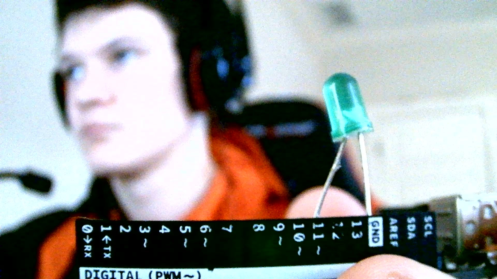

# Prerequisites

If you're reading this tutorial I'll assume the following:

* You have an Arduino + LEDs
* You know how to upload code to an Arduino.

If you don't meet those prerequisites, go to my tutorial on the bare minimum, here: <https://codedecatur.org/tutorials/arduino/how-to-install-and-use-the-arduino-ide>

# Connecting the LED to the Arduino.

Connect the anode of the LED (long leg) to pin 11 on the Arduino. Connect the cathode of the LED (short leg) to one of the grounds on the Arduino. It should look something like this:



NOTE: Any pin with a squiggle next to it will work for the following ideas, these pins are different from the others, the reason I used pin 11 is that it is closest to the ground.

# Coding time

First, open up your Arduino IDE, and make a new script by going to File -> New, or hit Ctrl+N. Now let's write some code on the Arduino. The first thing we need to do is declare and set the value of a variable equal to the pin number of the LED. I connected the anode of the LED to pin 11, so my variable will have the value 11. Then we'll use the pinMode() function to set the LED to an output. Lastly, we'll just turn it on for one second then turn it off for one second using the digitalWrite() function, which takes a pin number, and a value of either high or low as arguments. We do that in the loop() function, so it will continue to run.

```cpp
const int ledPin = 11; // the pin the anode of the LED is connected to. 

void setup() {
  // put your setup code here, to run once:
  pinMode(ledPin, OUTPUT); // set the LED pin to an output, so we can send voltage accross it.
}

void loop() {
  // put your main code here, to run repeatedly:
  digitalWrite(ledPin, HIGH); // turn LED on
  delay(1000); // wait one second(1000 milliseconds)
  digitalWrite(ledPin, LOW); // turn LED off
  delay(1000); // wait one second(1000 milliseconds)
}
```

Now you can turn an LED on, and off, so you can do whatever you want with it! The rest of the tutorial will be ideas of what you can do with it. I'll have: 

* A dimming, and brightening script
* A blink a certain number of times script
* A morse code script

But, that is as much knowledge as you need to be able to make the LED blink.


# Brighten, and Dim

Pretty self-explanatory, this script will make an LED get brighter, then dimmer. To do this we use the analogWrite() function, which takes a pin number, and an int from 0-255 to set the brightness of our LED. 

```cpp
const int ledPin = 11;

void setup() {
  // put your setup code here, to run once:
  pinMode(ledPin, OUTPUT);
}

void loop() {
  // put your main code here, to run repeatedly:
  for(int i=0; i < 255; i++){
    analogWrite(ledPin, i);
    delay(10);
  }
  for(int i=0; i < 255; i++){
    analogWrite(ledPin, 255-i);
    delay(10);
  }
}
```

You might be able to see how you could use this kind of code, along with multiple LEDs, to make customizable LED strips.


# Blink Number of Times

This one is also pretty self-explanatory, it will make the led a certain number of times. Try and figure this one out on your own before you keep reading, as it mainly uses code I've already talked about.

```cpp
const int ledPin = 11;
const int numTimes = 5;
bool hasRan = false; // a boolean is either true, or false

void setup() {
  // put your setup code here, to run once:
  pinMode(ledPin, OUTPUT);
}

void loop() {
  // put your main code here, to run repeatedly:
  if(not hasRan){
    for(int i=0; i < numTimes; i++){
      digitalWrite(ledPin, HIGH);
      delay(1000);
      digitalWrite(ledPin, LOW);
      delay(1000);
    }
    hasRan = true;
  }
}
```


# Morse code

This one is a little more complex and requires a little more work. If you don't know morse code is a series of blinks and dashes that make letters. Now, unfortunately, dictionaries technically exist in Arduino, but they are really annoying to work with so we won't be using them for this, even though they would likely be quite useful. So, instead, we'll use something similar, a 2D array with the first term of each 2D array is the letter it will represent. Just kidding, you can't do that either, because Arduino is statically typed which for our purposes means you can't have different data types stored in the same array. What we will actually do is have one array will our letters, in alphabetical order, and another with our functions