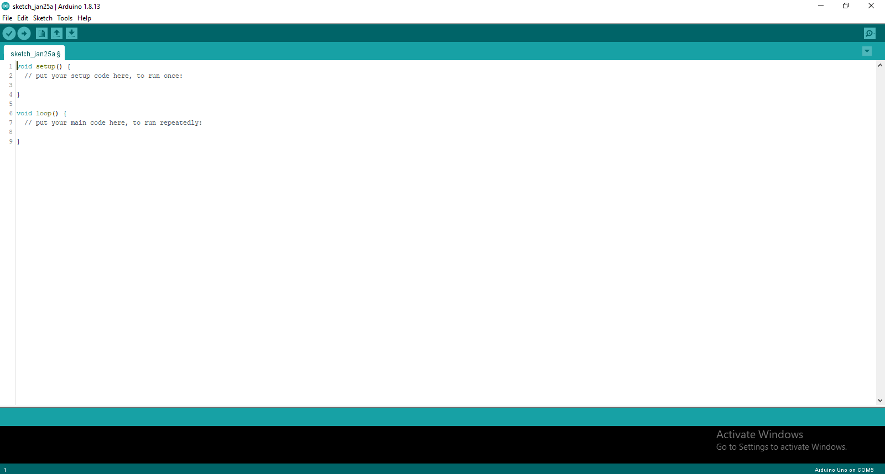
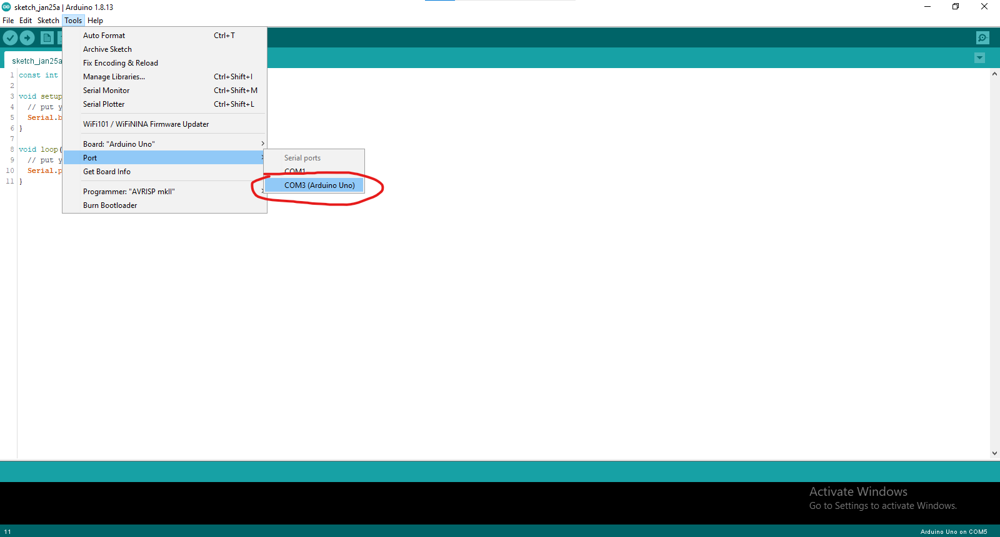
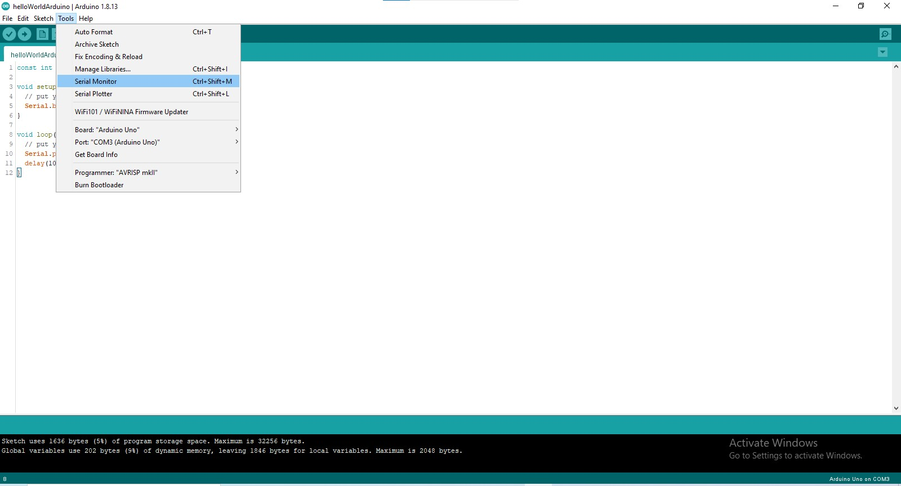

# Prerequisites

Before you continue reading this tutorial, it is important to note that you will need an Arduino, otherwise you can't run the code. 

* Link to Arduino kit - [](https://www.amazon.com/ELEGOO-Project-Tutorial-Controller-Projects/dp/B01D8KOZF4/ref=asc_df_B01D8KOZF4/?tag=hyprod-20&linkCode=df0&hvadid=309818716690&hvpos=&hvnetw=g&hvrand=2897166575195834165&hvpone=&hvptwo=&hvqmt=&hvdev=c&hvdvcmdl=&hvlocint=&hvlocphy=9010770&hvtargid=pla-406302474425&psc=1)<https://www.amazon.com/ELEGOO-Project-Tutorial-Controller-Projects/dp/B01D8KOZF4/>
* Link to just Arduino - [](https://www.amazon.com/ELEGOO-Board-ATmega328P-ATMEGA16U2-Compliant/dp/B01EWOE0UU/ref=sr_1_2_sspa?crid=2V08I03PGN0LZ&dchild=1&keywords=arduino+uno&qid=1611617340&s=industrial&sprefix=arduino%2Cindustrial%2C165&sr=1-2-spons&psc=1&spLa=ZW5jcnlwdGVkUXVhbGlmaWVyPUExVUU0MzRGOTJCUzMzJmVuY3J5cHRlZElkPUEwNTcwOTk5RjBVTTBMMExSTlNRJmVuY3J5cHRlZEFkSWQ9QTA3NjU3MzYzRUlDRUkxN1k0NUdYJndpZGdldE5hbWU9c3BfYXRmJmFjdGlvbj1jbGlja1JlZGlyZWN0JmRvTm90TG9nQ2xpY2s9dHJ1ZQ==)<https://www.amazon.com/ELEGOO-Board-ATmega328P-ATMEGA16U2-Compliant/dp/B01EWOE0UU/>
* Link to LEDs - <https://www.amazon.com/Cylewet-Emitting-Highlight-Arduino-CYT1035/dp/B01N4JA54A/>

If you're not sure if you want to commit to learning Arduino, just buy the Arduino only, but if you want to experiment, and make your own things after you understand the basics, I recommend getting the kit. You should also note that the Arduino is severely limited without components, so it is advisable to get at least something basic, like LEDs. From this point, I'll assume you have an Arduino.  

# Downloading the IDE

Now you have an Arduino, let's download the IDE, so go to <https://www.arduino.cc/en/software> and download the one that is for your operating system. There is also an online version, but I would recommend just downloading the IDE.

Now that it's downloaded, go ahead and launch the app. You should be prompted with a screen that looks something like this, 



# Writing Some Code

If you only have the Arduino, you are limited in what you can actually do, but that's fine for our purposes, so in the IDE type the following:

```cpp
void setup() {
  // put your setup code here, to run once:
  Serial.begin(9600); //start serial communication with a baud rate of 9600
}

void loop() {
  // put your main code here, to run repeatedly:
  Serial.println("Hello, World!"); //print hello world to the serial monitor
  delay(1000); //delay the program for 1 second (1000 milliseconds)
}
```

In the setup function we put code we only need to run once, this usually entails things like setting the pins for various components, starting serial communication(like we do here), and setting up other things. This code will print "Hello, World!" into the serial monitor every second. What is the serial monitor, and how do you access it? I'm glad you asked, but first, let's upload the code.

# Uploading the Code

Make sure you have the Arduino connected to a USB port on your computer, then make sure you have the correct port selected. To do this, look at the top of the IDE, click Tools -> Port -> then click the Arduino port.



Now that you have the correct port selected, let's upload the code. In the top left of the screen, click the arrow button. It should prompt you to save it, so name the file something like "helloWorldArduino", then it will upload your code to the Arduino.


# Accessing the Serial Monitor

Wondering where the text is being printed? It's on the Serial monitor! To see the Serial monitor, go to Tools -> Serial Monitor, or press Ctrl+Shift+M. 



Now, every second you should see "Hello, World!" print on the monitor. Congratulations, you just wrote, uploaded, and ran your first Arduino code.