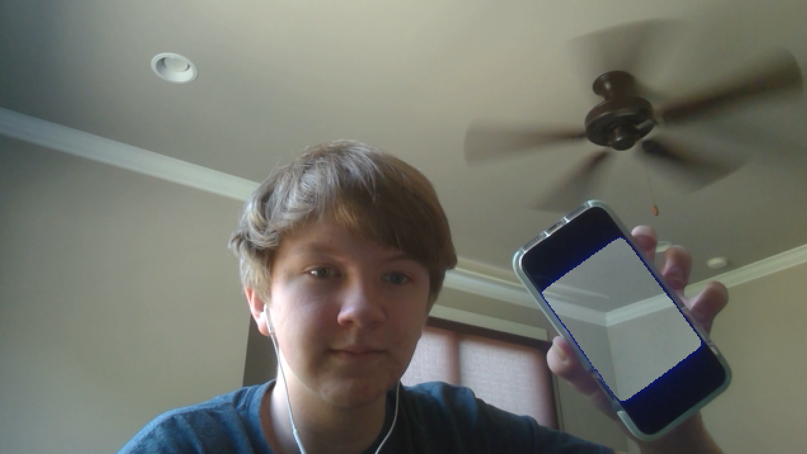
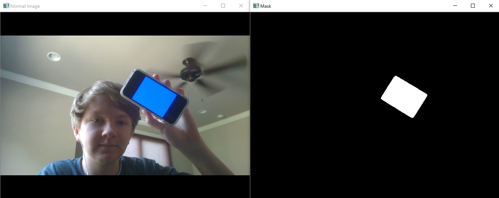
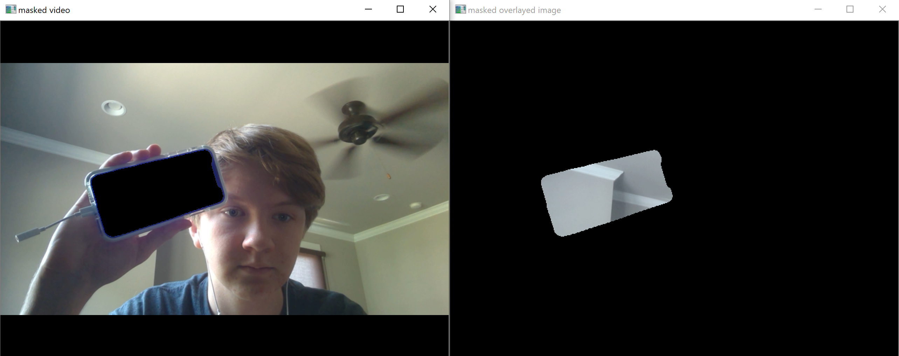

## Installing OpenCV
This tutorial is gonna be a lot easier if you first go over my [intro to OpenCV](https://codedecatur.org/tutorials/python/opencv-intro) tutorial. If you don't already have it installed, you can install it with `pip install opencv-python`. 

## Basic setup for video
To set up a greenscreen, we first need to set up video in OpenCV. This was covered in the above mentioned [intro tutorial](https://codedecatur.org/tutorials/python/opencv-intro), so I'll go over this part pretty quickly. To set up a video, we have to get a `VideoCapture()`, read it each frame with `cap.read()`, display it with `cv2.imshow()`, and wait between frames with `cv2.waitKey()`. Putting this all together we have a pretty basic setup for video:

```
import cv2

cap = cv2.VideoCapture(0)


while True:
    _, img = cap.read()

    cv2.imshow("Normal Image", img)

    cv2.waitKey(1)
```

## Filtering by color
To filter by color, we need to convert the image to HSV. This lets us set up a range of hues that are close to our greenscreen's color. My 'greenscreen' was the first result on my phone when I searched for "blue". To convert to HSV, we use the `cv2.cvtColor()` function. To create a mask that checks for that color, we use the `cv2.inRange()` function. The ranges I used for my blue were (100, 200, 120) and (120, 255, 255), for lower and upper respectively. Because of different webcam settings and phone settings, you may have to adjust these values. We also have to blur the image to make the mask less noisy. Putting these ideas into code, we get something like this:

```
import cv2

cap = cv2.VideoCapture(0)


while True:
    _, img = cap.read()

    cv2.imshow("Normal Image", img)

    blur = cv2.blur(img, (5, 5)) #Blur to reduce noise in image
    hsv = cv2.cvtColor(blur, cv2.COLOR_BGR2HSV) #Convert blurred to HSV for color filtering
    mask = cv2.inRange(hsv, (100, 200, 120), (120, 255, 255)) #Create a mask over the blue in the image

    cv2.imshow("Mask", mask)

    cv2.waitKey(5)
```


This can be a little tricky to get the ranges correct for. If you got it correct, however, you should see something like this:


## Doing the greenscreen
Applying a greenscreen is accomplished in three steps. First, we cut the mask out of the original image. Then, we only take the masked part of the image we want to apply over it. Finally, we add the pixels of these two images to get a final result. For the image we want to apply over the original, we'll just take a picture when the python program begins running, before the while loop:

```
import cv2

cap = cv2.VideoCapture(0)

_, overlayImg = cap.read()

while True:
    _, img = cap.read()

    cv2.imshow("Normal Image", img)

    blur = cv2.blur(img, (5, 5)) #Blur to reduce noise in image
    hsv = cv2.cvtColor(blur, cv2.COLOR_BGR2HSV) #Convert blurred to HSV for color filtering
    mask = cv2.inRange(hsv, (100, 200, 120), (120, 255, 255)) #Create a mask over the blue in the image

    cv2.imshow("Mask", mask)

    cv2.waitKey(5)
```
### Applying masks
 The next step is applying masks. Applying a mask means to keep the image where the pixels are white on the mask, but where the pixels are black on the mask set the image's pixels to black. To apply the mask, we can use the `cv2.bitwise_and(img, img, mask=mask)` function. The function is meant to perform the boolean and operator between each pixel, but we are using it to apply a mask, with the third argument. The first thing we want to do is to cut a hole in the shape of our mask in the video. To do this, we create a new mask, called `invMask`. To create it, we'll make the opposite of our mask that was produced from color filtering. To do this, we can use the `cv2.bitwise_not(img)` function. It performs the boolean not operator on each pixel. When applied to a mask, this inverts its colors. Creating this new mask and applying both to their respective images, we have the following code:

```
import cv2

cap = cv2.VideoCapture(0)

_, overlayImg = cap.read()

while True:
    _, img = cap.read()

    cv2.imshow("Normal Image", img)

    blur = cv2.blur(img, (5, 5)) #Blur to reduce noise in image
    hsv = cv2.cvtColor(blur, cv2.COLOR_BGR2HSV) #Convert blurred to HSV for color filtering
    mask = cv2.inRange(hsv, (100, 200, 120), (120, 255, 255)) #Create a mask over the blue in the image

    cv2.imshow("Mask", mask)

    invMask = cv2.bitwise_not(mask) #Invert mask

    imgWithMask = cv2.bitwise_and(img, img, mask=invMask)#Apply inverted mask to img

    overlayImgWithMask = cv2.bitwise_and(overlayImg, overlayImg, mask=mask)#Apply normal mask to overlay image

    cv2.imshow("masked video", imgWithMask)
    cv2.imshow("masked overlayed image", overlayImgWithMask)

    cv2.waitKey(5)
```

It should look something like this:



### Combining the images
Now, the only step left is to combine the above images! We can do this by just adding them together:
```
cv2.imshow("final", imgWithMask + overlayImgWithMask)
```

Your final result should look something like this:


## Final code
For troubleshooting purposes, your final code should be something close to this:
```
import cv2

cap = cv2.VideoCapture(0)

_, overlayImg = cap.read()

while True:
    _, img = cap.read()

    cv2.imshow("Normal Image", img)

    blur = cv2.blur(img, (5, 5)) #Blur to reduce noise in image
    hsv = cv2.cvtColor(blur, cv2.COLOR_BGR2HSV) #Convert blurred to HSV for color filtering
    mask = cv2.inRange(hsv, (100, 200, 120), (120, 255, 255)) #Create a mask over the blue in the image

    cv2.imshow("Mask", mask)

    invMask = cv2.bitwise_not(mask)

    imgWithMask = cv2.bitwise_and(img, img, mask=invMask)

    overlayImgWithMask = cv2.bitwise_and(overlayImg, overlayImg, mask=mask)

    cv2.imshow("masked video", imgWithMask)
    cv2.imshow("masked overlayed image", overlayImgWithMask)

    cv2.imshow("final", imgWithMask + overlayImgWithMask)

    cv2.waitKey(5)
```
