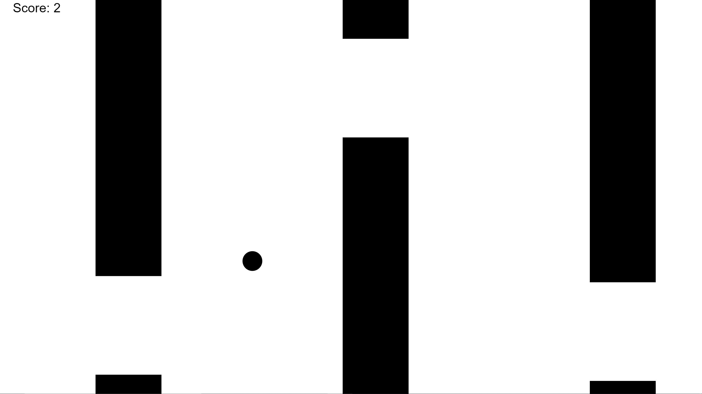
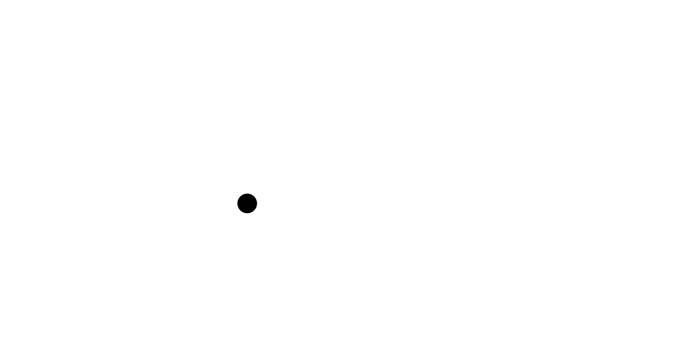

# Creating (Bad) Flappy Bird in HTML5/Javascript



[Play the game](https://veryclevername3.github.io/hosting/flappyBirdClone/index.html)

1.)
Open up a new folder in Visual Studio Code. In it, create two files: index.html and main.js:


## Creating HTML
2.)
Type the following markup into your index.html page. The &lt;html>, &lt;head>, and &lt;body> tags are all standard parts of a HTML5 document. The &lt;script> tag is the important one here, and will link our Javascript code to the HTML of the page:
```
<html>
    <head>

    </head>
    <body>

    </body>
    <script src="main.js"></script>
</html>
```


3.)
By defult, google adds some spacing to the edges of the body, and draws the canvas in a square. The &lt;style> tag is how you can put CSS in your code, which is the language most used for stylizing HTML. The following syntax means to set the size of the margin and padding of the body, both properties that add extra whitespace, to zero.
```
body{
    margin: 0px;
    padding: 0px;
}
``` 
The following sets the canvas to fill the whole screen, by setting both its width and height to 100%:

```
canvas{
    width: 100%;
    height: 100%;
}
```
Putting it all together, we have the following HTML5 code in the file:

```
<html>
    <head>
        <style>
            body{
                margin: 0px;
                padding: 0px;
            }
            canvas{
                width: 100%;
                height: 100%;
            }
        </style>
    </head>
    <body>

    </body>
    <script src="main.js"></script>
</html>
```

## Setting up Canvas
4.)
Now, switch to the main.js file. In it, we want to create a canvas. This is what we will draw the bird and pipes on. To create the canvas and add it to the body, we can use the following code. The first line creates a &lt;canvas> element, and the second line inserts it into the HTML of the webpage.

```
var c = document.createElement("canvas"); //Creates a canvas to draw on

document.body.append(c); //Attaches the canvas to the HTML of the page
```

We now have a canvas, but no way to draw on it. To fix this, we have to get the context of the canvas. This means we ask the canvas for a type of pen, in this case, 2d. The variable ctx stands for context, and will be used as the 'pen' to draw on our canvas:

```
var ctx = c.getContext("2d"); //Creates a 'pen' for us to draw on the canvas with
```

The canvas also does not usually choose the best possible resolution to display itself on. To fix this, we have to change the amount of pixels inside it. The &lt;style> tag from our HTML fixes it to be the size of our screen, so if we double what's called the 'internal size' of the canvas, we will be doubling its resolution:
```
//These lines increase the resolution of the canvas by changing the amount of pixels it uses.
var scale = 2;
c.width = window.innerWidth * scale;
c.height = window.innerHeight * scale;
```
Putting all of the above together, This is the full code that should be added to your main.js file.
```
var c = document.createElement("canvas"); //Creates a canvas to draw on

document.body.append(c); //Attaches the canvas to the HTML of the page

var ctx = c.getContext("2d"); //Creates a 'pen' for us to draw on the canvas with


//These lines increase the resolution of the canvas by changing the amount of pixels it uses.
var scale = 2;
c.width = window.innerWidth * scale;
c.height = window.innerHeight * scale;
```
5.)
The update function is where we will do most of the game’s logic, and the setInterval line calls the update function sixty times per second. It takes an argument of a function to call, and a time in milliseconds between each time it should call it. With a time of 1000/60 milliseconds, we're calling the update function 60 times per second. These ideas are represented by the following code. Type the following lines into the bottom of the main.js file.
```

//We will do per-frame game logic here
function update(){

}

//Calls the update function every 1000/60 milliseconds, which is equal to roughly sixty times per second. This means we'll have a 60 FPS game.
setInterval(update, 1000/60);
```

6.)
Now, we’ll create a few variables necessary to the game’s core function, such as the bird’s height and velocity. We’ll store these in an object called bird. We also want to set up gravity. Something interesting about the HTML5 &lt;canvas> element is that, when drawn on, the coordinate system goes left to right for x, starting at 0 on the left and increasing to the right, but the y axis starts and 0 on top and increases going down. To compensate for this, we will make gravity add to the bird's height instead of subtract. The variable declarations are marked between the underscores. The declarations should go to the corresponding place in your main.js file.
```
var c = document.createElement("canvas"); //Creates a canvas to draw on

document.body.append(c); //Attaches the canvas to the HTML of the page

var ctx = c.getContext("2d"); //Creates a 'pen' for us to draw on the canvas with
______________________________________

var gravity = 0.00025; //gravity is positive because the canvas starts at y=0 at the top

var bird = {
    height: 0,
    velocity: 0,
}
______________________________________

//These lines increase the resolution of the canvas by changing the amount of pixels it uses.
var scale = 2;
c.width = window.innerWidth * scale;
c.height = window.innerHeight * scale;


//We will do per-frame game logic here
function update(){

}

//Calls the update function every 1000/60 milliseconds, which is equal to roughly sixty times per second. This means we'll have a 60 FPS game.
setInterval(update, 1000/60);

```
7.)
Here we'll finally get a little bit of tangible progress. We get to start drawing things to the canvas, and working on the beginning of the game. Every frame, we want to clear the canvas, update each object's position based on gravity, user input, and their logic, and the draw each object. Right now, our only object is the bird. We also don't have user input set up yet, so we'll just be making the bird fall, and be drawn to the canvas each frame. To clear the canvas, you use the `ctx.clearRect()` function, which takes arguments of (x coordinate, y coordinate, width, height) to draw a clear rectangle. The x and y coordinates are the top left corner of the rectangle, and the height and width extend towards the positive end of their respective axes. To clear the whole canvas, we can use the following code:
```
//We will do per-frame game logic here
function update(){
    //Clear the canvas
    ctx.clearRect(0, 0, c.width, c.height);
}
```
Now, we want to make the bird fall. The math is a little bit hard to understand without knowledge of calculus, but the basic idea is that we can add a constant(gravity) to our bird's velocity each frame, and then add the velocity to the bird's actual y position each frame. This makes the bird fall a little faster each frame, which simulates how gravity works. Our gravity constant is basically the equivalent of Earth's -9.8. Adding this idea to the update function, it should look like this:
```
//We will do per-frame game logic here
function update(){
    //Clear the canvas
    ctx.clearRect(0, 0, c.width, c.height);

    //Update the bird's position to account for gravity
    bird.velocity += gravity;//positive change in y goes down because the canvas starts at 0 on top

    bird.height += bird.velocity;
}
```
We still need to draw the actual bird. In this case, we're really drawing a circle, because this is a coding tutorial and not a drawing one. The canvas context (ctx) works in a similar way to turtle graphics sometimes. To make it work, we have to begin a path, specify a line, and then we can fill it and close the path. We also want to set the color to black. To draw the circle, we have to make an arc, and then fill it. The arguments for the ctx.arc() function are (x coordinate, y coordinate, radius, startAngle, endAngle). The angles are in radians. To convert from degrees to radians, you multiply by pi/180. A full circle is 2*pi radians, the equivalent of 360 degrees. Just for style, I want to draw the bird a little to the left of the center of the page. A lot of using a canvas is figuring out how to make it fit on any computer screen, so the code can get a little bit complicated. Now, the update function should look like this:
```
//We will do per-frame game logic here
function update(){
    //Clear the canvas
    ctx.clearRect(0, 0, c.width, c.height);

    //Update the bird's position to account for gravity
    bird.velocity += gravity;//positive change in y goes down because the canvas starts at 0 on top

    bird.height += bird.velocity;

    //Draw the bird (It's really a circle);
    ctx.beginPath();
    ctx.fillStyle = "black";
    ctx.arc((c.width / 2) - c.height / 4, bird.height * c.height, c.height / 40, 0, Math.PI * 2);
    ctx.fill();
    ctx.closePath();
}
```

If you open the index.html page in your browser right now, you should see a black circle on the left side of the page that falls on page load.


## Setting up controls
8.)
Now, we're going to set up keyboard input. In Javascript, this is done with the onkeydown function. This is a special function because it gets called by the system every time the user presses a key on the keyboard, and passes the keydown event as an argument. To get the keycode, you use the e.which variable. We're creating an array that stores which keys were just pressed, and then clearing it at the end of the update function. Here's the relevant code to add to the top of the file
```
var keyDown = []; //true at newly pressed keys, false everywhere else

onkeydown = function(key){
    keyDown[key.which] = true; //Set keydown to true at index of keycode
}
```
Then, add the line that clears the keyDown array to the end of the update function.
```
Then, add the following code to the bottom of the update function, so the keys being pressed are cleared at the end of each frame:
//We will do per-frame game logic here
function update(){
    //Clear the canvas
    ctx.clearRect(0, 0, c.width, c.height);

    //Update the bird's position to account for gravity
    bird.velocity += gravity;//positive change in y goes down because the canvas starts at 0 on top

    bird.height += bird.velocity;

    //Draw the bird (It's really a circle);
    ctx.beginPath();
    ctx.fillStyle = "black";
    ctx.arc((c.width / 2) - c.height / 4, bird.height * c.height, c.height / 40, 0, Math.PI * 2);
    ctx.fill();
    ctx.closePath();

________________________________
    //clear the keyDown array
    keyDown = [];
________________________________
}
```
9.)
Now, we want the bird to flap, so we’ll check if the key spacebar is being pressed, which has a keycode of 32. If the player did press the spacebar, we want to set the bird’s velocity to be negative, because the canvas has a y of 0 at the top. This is solvable with a simple if-then statement. -0.01 was chosen as the velocity after a couple of guesses and tests. The update function should now look like this:
```
//We will do per-frame game logic here
function update(){
    //Clear the canvas
    ctx.clearRect(0, 0, c.width, c.height);

    //Update the bird's position to account for gravity
    bird.velocity += gravity; //positive change in y goes down because the canvas starts at 0 on top
    bird.height += bird.velocity;

_____________________________________________
    //Check if spacebar is being pressed
    if(keyDown[32]){
        bird.velocity = -0.01; //If it is, set the bird's velocity to point up.
    }
_____________________________________________

    //Draw the bird (It's really a circle);
    ctx.beginPath();
    ctx.fillStyle = "black";
    ctx.arc((c.width / 2) - c.height / 4, bird.height * c.height, c.height / 40, 0, Math.PI * 2);
    ctx.fill();
    ctx.closePath();

    //clear the keyDown array
    keyDown = [];
}
If you open the index.html file now, you should be able to press spacebar to make the ball flap.
```
## Adding pipes
10.)
We have a bird now, but we still need to add the obstacles. We also want to add a gameOver state, so that when the bird hits a pipe, the game ends. We're going to give each pipe a couple of properties. Each pipe will have an x coordinate, a y coordinate for the gap, a height for the gap, and a width. After setting all of these, we'll add it to an array of pipes, which will all be updated in the future. We also want the pipes to spawn in at fixed intervals. To do this, we'll use setInterval again, this time specifying 2000 milliseconds, or 2 seconds, as the time between pipe spawns. The following code should all go to the bottom of the main.js file.

```
var gameOver = false; //tells whether or not the game is over

var pipes = []; //All of the pipes' data will be stored here.

function makePipe(){
    var pipe = {
        x: c.width, //x coordinate of pipe. Starts at the right edge of the canvas
        gapY: (Math.random() * c.height * 3/4) + 1/8 * c.height, //y coordinate of the center of the gap in the pipe. Set to a random number in the middle 3/4 of the canvas
        gapHeight: 2/8 * c.height, //Size of the gap
        width: c.height / 6 //Width of the pipe
    }

    pipes.push(pipe); //Add the pipe to the pipes array. This is the equivalent of .append() in python
}


setInterval(makePipe, 2000); //Make a pipe every 2 seconds. The function takes milliseconds as an argument.
```


11.)
Now that we can create pipes, we want to move them. We can also make them check if they are hitting the player and set gameOver to true in the same loop. To move them, we just have to subtract a constant from the x coordinate of each pipe each frame. To tell if the player is in the gap, we check if the bird is close to the center of the gap while its x coordinate is between the x coordinate of the pipe and the other end of the pipe. If the bird is not close enough, we set gameOver to true, which, after some more code, will mean that the game is over. To call the updatePipes function each frame, we'll want to put it in the update function. The updatePipes function should go to the bottom of the main.js file and it should be called in the update function, as the code following this suggests:

```
function updatePipes(){
    for(i of pipes){
        i.x -= 0.005 * c.height; //move each pipe to the left
        if(Math.abs(bird.height * c.height - i.gapY) > i.gapHeight / 2 && ((c.width / 2) - c.height / 4) > i.x && ((c.width / 2) - c.height / 4) < i.x + i.width){ //If the bird is outside of the gap but in the pipe
            gameOver = true; //If the bird touches the pipe, end the game
        }
        ctx.fillRect(i.x, 0, i.width, i.gapY - i.gapHeight / 2);//Draw the top of the pipe
        ctx.fillRect(i.x, i.gapY + i.gapHeight/2, i.width, c.height);//Draw the top of the pipe

    }
}
```
```
//We will do per-frame game logic here
function update(){
    //Clear the canvas
    ctx.clearRect(0, 0, c.width, c.height);

    //Update the bird's position to account for gravity
    bird.velocity += gravity; //positive change in y goes down because the canvas starts at 0 on top
    bird.height += bird.velocity;

    //Check if spacebar is being pressed
    if(keyDown[32]){
        bird.velocity = -0.01; //If it is, set the bird's velocity to point up.
    }

    //Draw the bird (It's really a circle);
    ctx.beginPath();
    ctx.fillStyle = "black";
    ctx.arc((c.width / 2) - c.height / 4, bird.height * c.height, c.height / 40, 0, Math.PI * 2);
    ctx.fill();
    ctx.closePath();
______________________________
    //Update the pipes
    updatePipes();
______________________________
    //clear the keyDown array
    keyDown = [];
}
```

12.)
Now, we want to end the game when the gameOver variable is true. To do this, we can put an if statement around the update function’s contents and show the game over screen when gameOver is true. We can draw text with the ctx.fillText() function, which takes arguments as (text, x coordinate, y coordinate). The ctx.fillRect() function works the same way as clearRect, but instead of clearing everything it draws in the color specified by the ctx.fillStlye variable. Here's what your new update function should resemble:
```
//We will do per-frame game logic here
function update(){
    //Clear the canvas
    ctx.clearRect(0, 0, c.width, c.height);
    if(!gameOver){
        //Update the bird's position to account for gravity
        bird.velocity += gravity; //positive change in y goes down because the canvas starts at 0 on top
        bird.height += bird.velocity;

        //Check if spacebar is being pressed
        if(keyDown[32]){
            bird.velocity = -0.01; //If it is, set the bird's velocity to point up.
        }

        //Draw the bird (It's really a circle);
        ctx.beginPath();
        ctx.fillStyle = "black";
        ctx.arc((c.width / 2) - c.height / 4, bird.height * c.height, c.height / 40, 0, Math.PI * 2);
        ctx.fill();
        ctx.closePath();

        //Update the pipes
        updatePipes();

        //clear the keyDown array
        keyDown = [];
    } else {
        //draw gameover screen
        ctx.fillStyle = "red";
        ctx.fillRect(0, 0, c.width, c.height); 
        ctx.fillStyle = "black";
        ctx.font = "50px sans-serif";
        ctx.fillText("Game Over!", c.width / 2, c.height / 2);
    }
}
```

13.)
Now, all we have to do is add a score. Let’s make sure each pipe is only scored once, and increment a score variable each time the player enters one. We also need to draw the score. We can draw the score with the ctx.fillText() function. We can make sure each pipe is only scored once by adding a scored property to each of them, and then setting it to true after the bird crosses into them and the score variable is incremented. Make the following changes in the code, surrounded by the underlines. This is also what your final code should look like (minus the unerlines):

```
var keyDown = []; //true at newly pressed keys, false everywhere else

onkeydown = function(key){
    keyDown[key.which] = true; //Set keydown to true at index of keycode
}

var c = document.createElement("canvas"); //Creates a canvas to draw on

document.body.append(c); //Attaches the canvas to the HTML of the page

var ctx = c.getContext("2d"); //Creates a 'pen' for us to draw on the canvas with

var gravity = 0.00025; //gravity is positive because the canvas starts at y=0 at the top

var bird = {
    height: 0.5,
    velocity: 0,
}

//These lines increase the resolution of the canvas by changing the amount of pixels it uses.
var scale = 2;
c.width = window.innerWidth * scale;
c.height = window.innerHeight * scale;


//We will do per-frame game logic here
function update(){
    //Clear the canvas
    ctx.clearRect(0, 0, c.width, c.height);
    if(!gameOver){
        //Update the bird's position to account for gravity
        bird.velocity += gravity; //positive change in y goes down because the canvas starts at 0 on top
        bird.height += bird.velocity;

        //Check if spacebar is being pressed
        if(keyDown[32]){
            bird.velocity = -0.01; //If it is, set the bird's velocity to point up.
        }

        //Draw the bird (It's really a circle);
        ctx.beginPath();
        ctx.fillStyle = "black";
        ctx.arc((c.width / 2) - c.height / 4, bird.height * c.height, c.height / 40, 0, Math.PI * 2);
        ctx.fill();
        ctx.closePath();

        //Update the pipes
        updatePipes();

        //clear the keyDown array
        keyDown = [];
_____________________________________
        //Draw score text
        ctx.fillStyle = "black";
        ctx.strokeStyle = "white";
        ctx.lineWidth = 10;
        ctx.font = "50px sans-serif";
        ctx.strokeText("Score: " + score, 50, 50);
        ctx.fillText("Score: " + score, 50, 50);
_____________________________________
    } else {
        ctx.fillStyle = "red";
        ctx.fillRect(0, 0, c.width, c.height); //
        ctx.fillStyle = "black";
        ctx.font = "50px sans-serif";
        ctx.fillText("Game Over!", c.width / 2, c.height / 2);
    }
}

//Calls the update function every 1000/60 milliseconds, which is equal to roughly sixty times per second. This means we'll have a 60 FPS game.
setInterval(update, 1000/60);

var gameOver = false; //tells whether or not the game is over

var pipes = []; //All of the pipes' data will be stored here.

function makePipe(){
    var pipe = {
        x: c.width, //x coordinate of pipe. Starts at the right edge of the canvas
        gapY: (Math.random() * c.height * 3/4) + 1/8 * c.height, //y coordinate of the center of the gap in the pipe. Set to a random number in the middle 3/4 of the canvas
        gapHeight: 2/8 * c.height, //Size of the gap
_____________________________________
        width: c.height / 6, //Width of the pipe
        scored: false //whether or not a pipe has been scored
_____________________________________
    }

    pipes.push(pipe); //Add the pipe to the pipes array. This is the equivalent of .append() in python
}

setInterval(makePipe, 2000); //Make a pipe every 2 seconds. The function takes milliseconds as an argument.


_____________________________________
var score = 0; //keeps track of score
_____________________________________

function updatePipes(){
    for(i of pipes){
_____________________________________
        //If past the pipe's entrance, count the pipe as scored and increment the score variable
        if(((c.width / 2) - c.height / 4) > i.x && !i.scored){ 
            i.scored = true;
            score++;
        }
_____________________________________


        i.x -= 0.005 * c.height; //move each pipe to the left
        if(Math.abs(bird.height * c.height - i.gapY) > i.gapHeight / 2 && ((c.width / 2) - c.height / 4) > i.x && ((c.width / 2) - c.height / 4) < i.x + i.width){ //If the bird is outside of the gap but in the pipe
            gameOver = true; //If the bird touches the pipe, end the game
        }
        ctx.fillRect(i.x, 0, i.width, i.gapY - i.gapHeight / 2);//Draw the top of the pipe
        ctx.fillRect(i.x, i.gapY + i.gapHeight/2, i.width, c.height);//Draw the top of the pipe

    }
}
```
## Final code
Here’s the final code for each file if you just want to copy and paste it or troubleshoot errors in your code:

### index.html
```
<html>
    <head>
        <style>
            body{
                margin: 0px;
                padding: 0px;
            }
            canvas{
                width: 100%;
                height: 100%;
            }
        </style>
    </head>
    <body>

    </body>
    <script src="main.js"></script>
</html>
```

### main.js
```
var keyDown = []; //true at newly pressed keys, false everywhere else

onkeydown = function(key){
    keyDown[key.which] = true; //Set keydown to true at index of keycode
}

var c = document.createElement("canvas"); //Creates a canvas to draw on

document.body.append(c); //Attaches the canvas to the HTML of the page

var ctx = c.getContext("2d"); //Creates a 'pen' for us to draw on the canvas with

var gravity = 0.00025; //gravity is positive because the canvas starts at y=0 at the top

var bird = {
    height: 0.5,
    velocity: 0,
}

//These lines increase the resolution of the canvas by changing the amount of pixels it uses.
var scale = 2;
c.width = window.innerWidth * scale;
c.height = window.innerHeight * scale;


//We will do per-frame game logic here
function update(){
    //Clear the canvas
    ctx.clearRect(0, 0, c.width, c.height);
    if(!gameOver){
        //Update the bird's position to account for gravity
        bird.velocity += gravity; //positive change in y goes down because the canvas starts at 0 on top
        bird.height += bird.velocity;

        //Check if spacebar is being pressed
        if(keyDown[32]){
            bird.velocity = -0.01; //If it is, set the bird's velocity to point up.
        }

        //Draw the bird (It's really a circle);
        ctx.beginPath();
        ctx.fillStyle = "black";
        ctx.arc((c.width / 2) - c.height / 4, bird.height * c.height, c.height / 40, 0, Math.PI * 2);
        ctx.fill();
        ctx.closePath();

        //Update the pipes
        updatePipes();

        //clear the keyDown array
        keyDown = [];

        //Draw score text
        ctx.fillStyle = "black";
        ctx.strokeStyle = "white";
        ctx.lineWidth = 10;
        ctx.font = "50px sans-serif";
        ctx.strokeText("Score: " + score, 50, 50);
        ctx.fillText("Score: " + score, 50, 50);
    } else {
        ctx.fillStyle = "red";
        ctx.fillRect(0, 0, c.width, c.height); //
        ctx.fillStyle = "black";
        ctx.font = "50px sans-serif";
        ctx.fillText("Game Over!", c.width / 2, c.height / 2);
    }
}

//Calls the update function every 1000/60 milliseconds, which is equal to roughly sixty times per second. This means we'll have a 60 FPS game.
setInterval(update, 1000/60);

var gameOver = false; //tells whether or not the game is over

var pipes = []; //All of the pipes' data will be stored here.

function makePipe(){
    var pipe = {
        x: c.width, //x coordinate of pipe. Starts at the right edge of the canvas
        gapY: (Math.random() * c.height * 3/4) + 1/8 * c.height, //y coordinate of the center of the gap in the pipe. Set to a random number in the middle 3/4 of the canvas
        gapHeight: 2/8 * c.height, //Size of the gap
        width: c.height / 6, //Width of the pipe
        scored: false //whether or not a pipe has been scored
    }

    pipes.push(pipe); //Add the pipe to the pipes array. This is the equivalent of .append() in python
}

setInterval(makePipe, 2000); //Make a pipe every 2 seconds. The function takes milliseconds as an argument.

var score = 0; //keeps track of score

function updatePipes(){
    for(i of pipes){
        //If past the pipe's entrance, count the pipe as scored and increment the score variable
        if(((c.width / 2) - c.height / 4) > i.x && !i.scored){ 
            i.scored = true;
            score++;
        }


        i.x -= 0.005 * c.height; //move each pipe to the left
        if(Math.abs(bird.height * c.height - i.gapY) > i.gapHeight / 2 && ((c.width / 2) - c.height / 4) > i.x && ((c.width / 2) - c.height / 4) < i.x + i.width){ //If the bird is outside of the gap but in the pipe
            gameOver = true; //If the bird touches the pipe, end the game
        }
        ctx.fillRect(i.x, 0, i.width, i.gapY - i.gapHeight / 2);//Draw the top of the pipe
        ctx.fillRect(i.x, i.gapY + i.gapHeight/2, i.width, c.height);//Draw the top of the pipe

    }
}
```