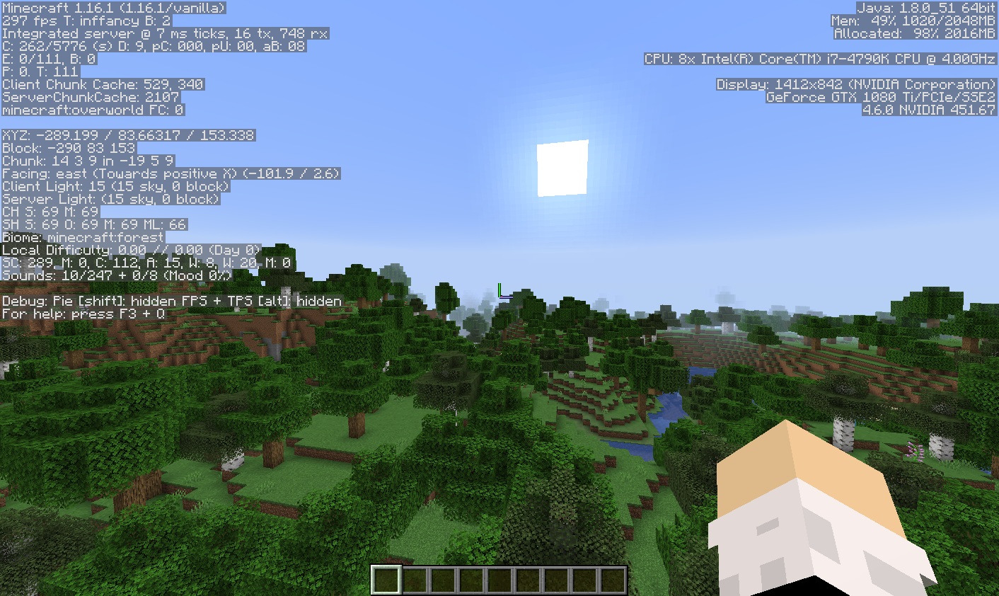
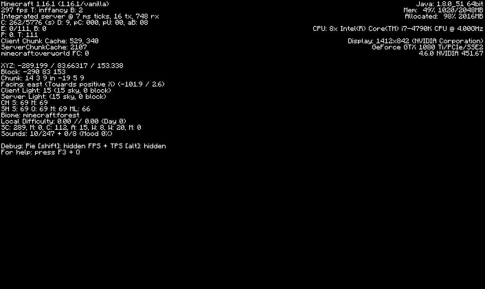
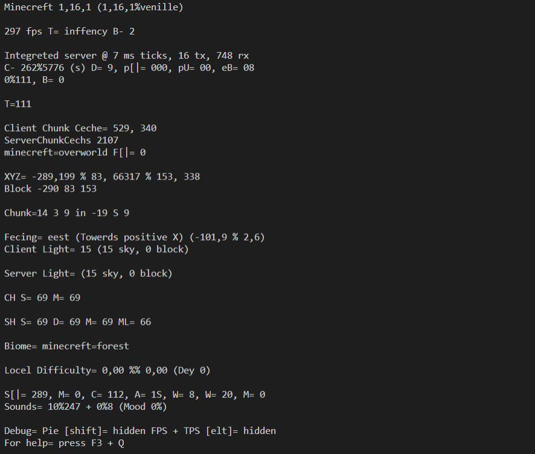
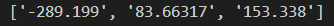

#What is PyTesseract and OCR?

PyTesseract is an OCR (Optical Character Recognition) tool for Python. Tesseract is available for other languages too, but Python is what I'll be using to do OCR.

OCR lets a program read text on a screen and translate that text into strings.

#Getting started

To get started with Tesseract, we'll need to install the executable. 
You can find that [here](https://tesseract-ocr.github.io/tessdoc/4.0-with-LSTM.html#400-alpha-for-windows).

We don't just need the executable though. We're going to need some additional modules to get PyTesseract up and running (including PyTesseract).

```
pip install pytesseract
```
For this tutorial, I'm going to try to parse the coordinates in a Minecraft world. Let's try to do that with Tesseract.
First, lets import Image from Pillow, and pytesseract.

```
from PIL import Image as im
import pytesseract
```

To get PyTesseract to work, we're going to have to direct it to the place we installed tesseract to. For me, thats C:\Program Files\Tesseract-OCR.

```
from PIL import Image as im
import pytesseract
import cv2

pytesseract.pytesseract.tesseract_cmd = r'C:\Program Files\Tesseract-OCR\tesseract.exe'
```

Let's take that screenshot.

Lets open this with Pillow's Image and try to use Tesseract to parse it.

```
from PIL import Image as im
import pytesseract
import cv2

pytesseract.pytesseract.tesseract_cmd = r'C:\Program Files\Tesseract-OCR\tesseract.exe'

image = im.open(r'screenshot.png')
text = pytesseract.image_to_string(image)
print(text)
```

Hmm, so it seems we didn't get any text back. This means Tesseract wasn't able to find anything. This makes sense. 
Tesseract doesn't support the Minecraft font, and it's so unusual that it makes sense that it couldn't pick up any words.

##Custom fonts

To train Tesseract for a new font, I used jTessBoxEditor and serak-tesseract-trainer (Although jTessBoxEditor proved much more helpful).
This process is painful, and I wouldn't recommend it. So to save you time, and pain, here is the .traineddata. 

[mc.traineddata](https://github.com/xHayden/Minecraft-OCR)

Go to "C:\Program Files\Tesseract-OCR\tessdata" and place this file there. 

To use this trainddata instead of the default, we'll add an argument in our pytesseract.image\_to\_string call.

```
from PIL import Image as im
import pytesseract
import cv2

pytesseract.pytesseract.tesseract_cmd = r'C:\Program Files\Tesseract-OCR\tesseract.exe'

image = im.open(r'screenshot.png')
text = pytesseract.image_to_string(image, lang='mc')
print(text)
```

However, running this, we still get no response.
It seems like the text cannot be clearly distinguished from the background.

We'll apply a filter to get rid of that. Lets use opencv for this.

##Isolating the text

```
pip install opencv-python
```

We import OpenCV as cv2.
We also need to import numpy in order to properly make a mask of the text we're trying to isolate.

We first convert the image to hsv. Then we make numpy arrays to store the image data.
We use numpy arrays of colors to isolate what we need with a mask. To make it easier, you can just trial and error the values.
We then make a mask with cv2.inRange() and use cv2.bitwise_and to remove the colors not included in the coordinate text.

Finally, we convert the colors to greyscale and use cv2.threshold to convert all colors to either white or black.

Now the coordinate text is perfectly clear, and we should be able to read it with Tesseract.

```
from PIL import Image as im
import pytesseract
import cv2
import numpy as np

pytesseract.pytesseract.tesseract_cmd = r'C:\Program Files\Tesseract-OCR\tesseract.exe'
image = im.open(r'screenshot.png')

image = cv2.cvtColor(np.array(image), cv2.COLOR_RGB2HSV)
hsv_image = cv2.cvtColor(np.array(image), cv2.COLOR_RGB2HSV)

color_lower = np.array([100, 255, 220])
color_upper = np.array([200, 255, 230])

mask = cv2.inRange(hsv_image, color_lower, color_upper)
result = cv2.bitwise_and(image, image, mask=mask)
image = cv2.cvtColor(np.array(result), cv2.COLOR_RGB2GRAY)

image = cv2.threshold(image, 0, 255, cv2.THRESH_BINARY | cv2.THRESH_OTSU)[1]

text = pytesseract.image_to_string(image, lang='mc')
print(text)
```





Yes! We got a response. It isn't perfect, but the text is readable. The algorithm seems to get confused with some characters,
particularly 'e' and 'a' and ',' vs '.'.

Let's use this text to get the coordinates.
First though, let's crop out the useless information. 

##Cropping

To do this we're going to use numpy slicing. 

Let's add this code to the end of our file.
```
y = 180
x = 0
h = 20
w = 500

crop_img = image[y:y+h, x:x+w]
cv2.imshow("cropped", crop_img)
cv2.waitKey(0)
```


Now we've cropped in on our coordinates. Of course the location depends on the resolution of your image. Configure it as you wish.

Let's make Tesseract use this image instead.

```
from PIL import Image as im
import pytesseract
import cv2
import numpy as np

pytesseract.pytesseract.tesseract_cmd = r'C:\Program Files\Tesseract-OCR\tesseract.exe'
image = im.open(r'screenshot.png')

image = cv2.cvtColor(np.array(image), cv2.COLOR_RGB2HSV)
hsv_image = cv2.cvtColor(np.array(image), cv2.COLOR_RGB2HSV)

color_lower = np.array([100, 255, 220])
color_upper = np.array([200, 255, 230])

mask = cv2.inRange(hsv_image, color_lower, color_upper)

result = cv2.bitwise_and(image, image, mask=mask)
image = cv2.cvtColor(np.array(result), cv2.COLOR_RGB2GRAY)
image = cv2.threshold(image, 0, 255,
    cv2.THRESH_BINARY | cv2.THRESH_OTSU)[1]

y = 180
x = 0
h = 20
w = 500

crop_img = image[y:y+h, x:x+w]

text = pytesseract.image_to_string(crop_img, lang='mc')
print(text)
```

It's not perfect, but it works. Let's parse this into an array.

```
from PIL import Image as im
import pytesseract
import cv2
import numpy as np

pytesseract.pytesseract.tesseract_cmd = r'C:\Program Files\Tesseract-OCR\tesseract.exe'
image = im.open(r'screenshot.png')

image = cv2.cvtColor(np.array(image), cv2.COLOR_RGB2HSV)
hsv_image = cv2.cvtColor(np.array(image), cv2.COLOR_RGB2HSV)

color_lower = np.array([100, 255, 220])
color_upper = np.array([200, 255, 230])

mask = cv2.inRange(hsv_image, color_lower, color_upper)

result = cv2.bitwise_and(image, image, mask=mask)
image = cv2.cvtColor(np.array(result), cv2.COLOR_RGB2GRAY)
image = cv2.threshold(image, 0, 255,
    cv2.THRESH_BINARY | cv2.THRESH_OTSU)[1]

y = 180
x = 0
h = 20
w = 500

crop_img = image[y:y+h, x:x+w]

text = pytesseract.image_to_string(crop_img, lang='mc')

textArr = text.split()
coordsArr = []
for string in textArr:
    if(any(char.isdigit() for char in string)):
        if(',' in string):
            string = string.replace(',', '.')
        coordsArr.append(string)
print(coordsArr)
```


There we go! We've successfully parsed the coordinates from a screenshot with PyTesseract.

#Conclusion
PyTesseract is a very powerful tool. Sometimes it needs configuration, but it can allow you to automate a lot of tasks that would be painful for a human to do manually, and the additional setup can definitely be worth it. 