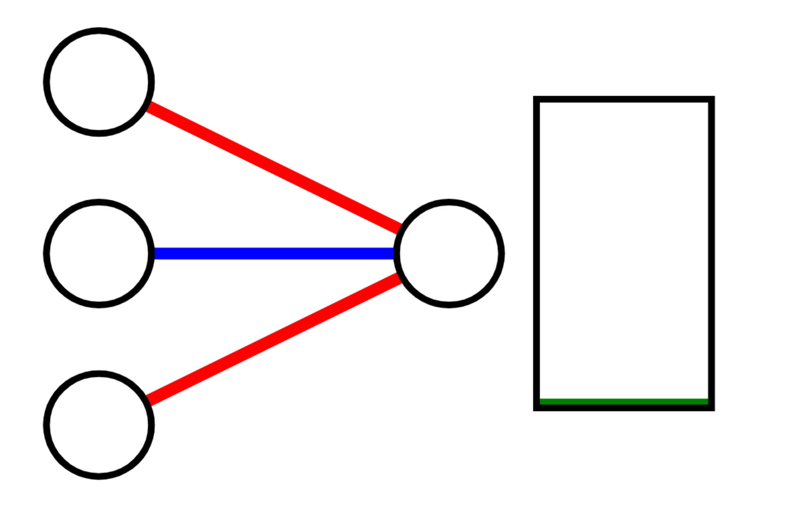
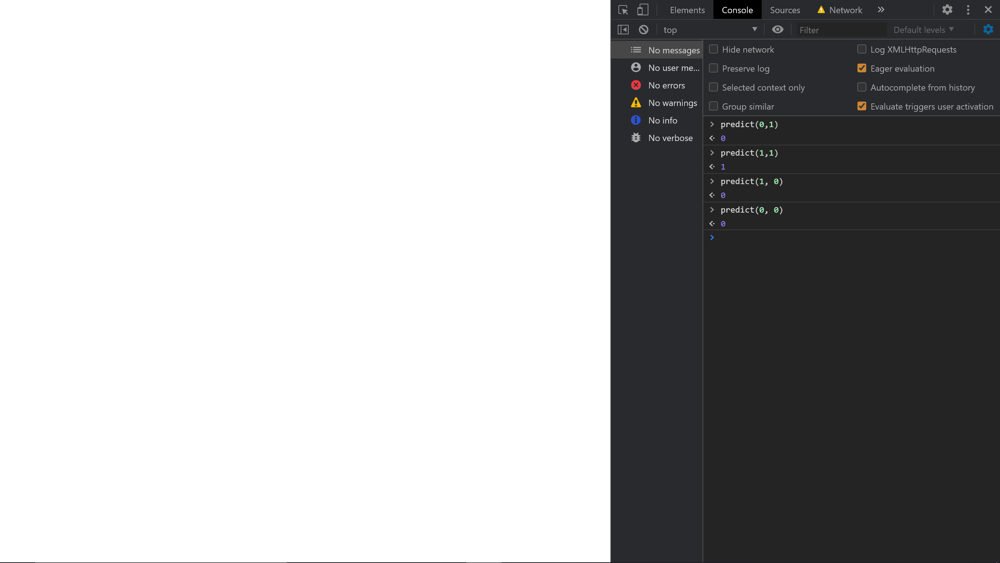

You've probably heard the comparison before that a neural network is kind of like a simple brain. If you haven't, well, a neural network is kind of like a simple brain. 

This doesn't help out a ton without context on how a brain works. Basically, a brain is composed of lots and lots of neurons. Each neuron can make tiny decisions about things, but when put together in complicated webs, you're able to make more complicated decisions. To make these decisions, each neuron takes in chemicals from neurons connected to one end, (the input end) counts how much of each chemical there are, and if the count of chemicals reaches a certain threshold, the neuron will send a chemical to the neurons that it's connected to on the output end. Each chemical is worth a different value, as well. 

For example, a hypothetical "happiness neuron" would count each "happy chemical" as +1, and each "angry chemical" as -1. If this total is greater than 0, the "happiness neuron" would send a "yes I am happy" chemical, and if the total was less than 0, it wouldn't send anything. In psuedocode, this neuron would function as follows:

```
return ((+1) * happyChemical + (-1) * angryChemical > 0)
```

This is the basic premise of a neural network. In computers, a neuron is given numbers from each neuron behind it. It then multiplies each number by a weight (think of this as the (+1) and (-1) in the example above), adds them all up, and checks the final value. If the weights are set up correctly, the neuron will be able to produce the correct result.

There's one more part to a neuron's function. When it's checking if it has met the threshold, sometimes it'll have what's called a bias. Say we have a neuron that gets input from a board game. In this board game, there are blue and red pieces. You get one point for each piece you play. If blue has three more pieces than red, or more, blue is winning. Otherwise, red is winning.

If our goal is to have a neuron that works with the `return (weight * input + weight * input > 0)` method, this won't work for the situation. Our formula would look something like this, because red and blue pieces each add one to your score when you place them:

```
return ((+1)) * blue + (-1)) * red > 0)
```

This is an easy problem to fix. We can just subtract two from the sum, and it'll accurately predict who's winning:

```
return ((+1) * blue + (-1) * red + (-2) > 0)
```

Testing this with 6 blue pieces and 3 red pieces, 6 - 3 - 2 = 1, 1 is greater than 0, blue is winning. With 5 blue and 3 red, 5 - 3 - 2 = 0, 0 is not greater than 0, red is winning. The -2 is called a bias. It's the same as a weight, but the input you multiply it by is always 1. 

With these rules in place, a neuron's counting can be boiled down to the following math:

weight1 * input1 + weight2 * input2 + weight3 * input3 + ... + bias

Where the weights are the numbers like (+1) and (-1) in our examples, and the inputs are the information given by neurons before, or just straight input, like numbers of blue or red pieces. The bias is like a y-intercept.

After this, our the neurons in our tutorial will check if this count is greater than 0 or not. 

(There are other ways to use the count of a neuron, but they get pretty complicated and aren't necessary for this tutorial. If you want to research them, they're called 'activation functions')

## The "Learning" part of Machine Learning

So, now that our neurons can make guesses given the correct weights and bias, we need to figure out how to set these weights and biases. 

This process is called learning or training. There's a couple of ways to do this that people use, but the one we're using for this tutorial is called *gradient descent*. This is a pretty intimidating name, but it's based on a simple idea. 

When our neurons are wrong, the amount that they're wrong is called error. *gradient descent* is the idea that, to make the weights better, we should change them so that the error is smaller. The name comes from the idea that our error *descends* over time.

Let's take the example of our blue/red pieces game. Let's start with an untrained neuron that guesses who wins, with randomized weight and bias:

```
return (-5 * blue + 7 * red - 18 > 0)
```

Now, we'll check how well it works with the example of 6 blue pieces and 3 red ones:

-5 * 6 + 7 * 3 - 18 = -30 + 21 - 18 = -27. -27 is not greater than 0, so it thinks that red won, when blue was the actual winner. This means that the correct number was supposed to be higher, so we re-adjust the weights and bias one by one to account for that.

The first weight was -5, and the first input was 6. our result was 0, when it should have been 1. This means our error was (expected - output) = 1 - 0 = 1. Now, we adjsut the weight by error * input. This is to make sure we account for the size of the input and the error. If the input was large, it means it likely had a large impact on the final output. In this case, we adjust the first weight by 1 * 6, or:

```
weight1 += 1 * 6
```

This gives us a new weight of (+1), which is the correct weight.

For the red weight, however, we get a different story. Repeating the above process, we get weight2 += 3 * 1. This sets it to a new value of 10. While this is the wrong direction, it's in the wrong direction by a smaller margin. If we do it to the bias, we get a new bias of bias += 1 * 1 (input for bias is always 1), or a new bias of -17, which is a change in the correct direction.

Now let's train our neuron again, with a different input. Let's try 3 blue pieces and 4 red pieces. Our output is (1 * 3 + 10 * 4 - 17) > 0 = True. The neuron thinks that blue should have won, but red won. This means our error is expected - output = (0 - 1) = -1

Our new weights are as follows:

```
weight1 += -1 * 3 

weight2 += -1 * 4

bias += -1 * 1
```

The new values are -2, 6, and -18. After only two repititions, all of our weights and bias are either closer to the correct values or equal to their starting values. 

The idea behind training like this is that with enough random scores, we should eventually get the correct weights and bias.

## Code!

Make a main.js and index.html file. Reference the main.js file in the HTML:
```
<script src="main.js"></script>
```

With all of that said, let's write some code. Our 'neural network' is going to be one neuron and will learn to do the 'and' operator. The 'and' operator (with numbers) uses 1 as true, and 0 as false. Here's the four possible inputs and their outcomes:

>
    input, expected output

    1, 1: 1
    1, 0: 0
    0, 1: 0
    0, 0: 0


Actually making our neuron, we're going to have two weights and a bias. In the main.js file, we'll declare these variables:

```
var weight1 = 0;
var weight2 = 0;
var bias = 0;
```

Now, we'll make a function to train the neuron:

```
var weight1 = 0;
var weight2 = 0;
var bias = 0;

function train(input1, input2, expected){
    var output = weight1 * input1 + weight2 * input2 + bias;

    var error = expected - output;

    weight1 += error * input1;

    weight2 += error * input2;

    bias += error;

    return output;
}
```

Here, we'll add the data in:

```
var data = [[1, 1, 1], [1, 0, 0], [0, 1, 0], [0, 0, 0]]; //Formatted [input1, input2, expected output]

var weight1 = 0;
var weight2 = 0;
var bias = 0;

function train(input1, input2, expected){
    var output = weight1 * input1 + weight2 * input2 + bias;

    output = 1 * (output > 0)

    var error = expected - output;

    weight1 += error * input1;

    weight2 += error * input2;

    bias += error;

    return output;
}
```

And then a function to train with it:

```
function trainWithData(){
    train(...data[Math.floor(Math.random() * data.length)]); //This syntax isn't super common, but we're just picking a random data and using it as the arguments
}
```

Now, let's add a prediction function, which doesn't retrain the neuron:
```
function predict(input1, input2){
    return 1 * (weight1 * input1 + weight2 * input2 + bias > 0);
}
```

Now we'll train it probably too many times (put this at the bottom of your file):
```
for(var i = 0; i < 100; i++)
    trainWithData();
```

Your full main.js file should look like this:

```
var data = [[1, 1, 1], [1, 0, 0], [0, 1, 0], [0, 0, 0]]; //Formatted [input1, input2, expected output]

var weight1 = 0;
var weight2 = 0;
var bias = 0;

function train(input1, input2, expected){
    var output = weight1 * input1 + weight2 * input2 + bias;

    output = 1 * (output > 0)

    var error = expected - output;

    weight1 += error * input1;

    weight2 += error * input2;

    bias += error;

    return output;
}

function trainWithData(){
    train(...data[Math.floor(Math.random() * data.length)]); //This syntax isn't super common, but we're just picking a random index of data and using the array there as the arguments
}

function predict(input1, input2){
    return 1 * (weight1 * input1 + weight2 * input2 + bias > 0);
}

for(var i = 0; i < 100; i++){
    trainWithData();
}
```

## Testing it!

Open up the index.html file. Now we can test the neuron in the console. If you haven't used the console before, you can access it by right clicking anywhere on the page, clicking inspect, then clicking the console tab in the window that opens. In the console, we can call predict(1, 1) and we should get 1. Same goes for the other in/out pairs: 

>
    input, expected output

    1, 1: 1
    1, 0: 0
    0, 1: 0
    0, 0: 0



And it works! You should be able to test it with the 'or' boolean operator again if you want to by changing the data to match it. The 'XOR' boolean operator will not work, because of a problem called 'linear separability'. That issue and its solution are probably coming up in another tutorial in the near future.