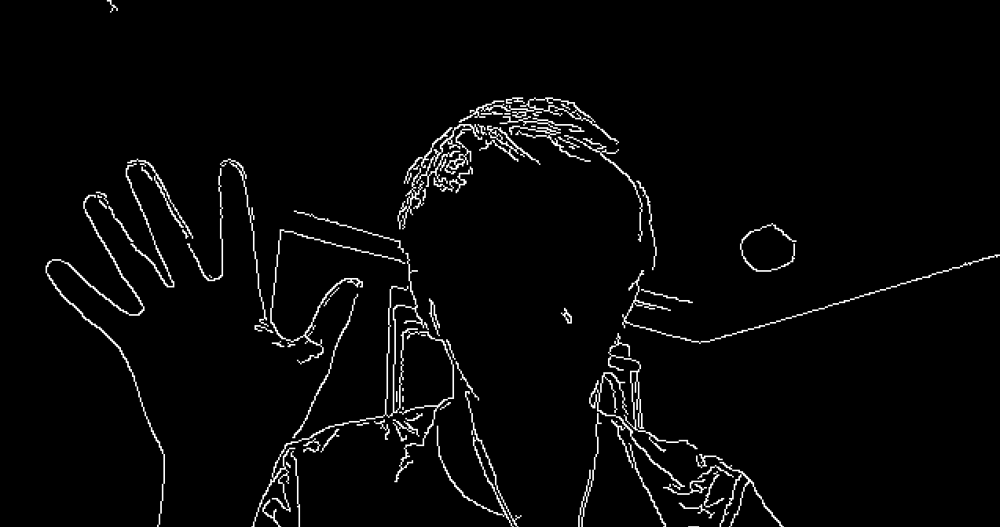
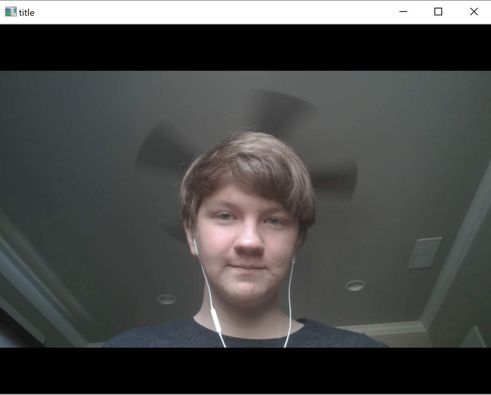
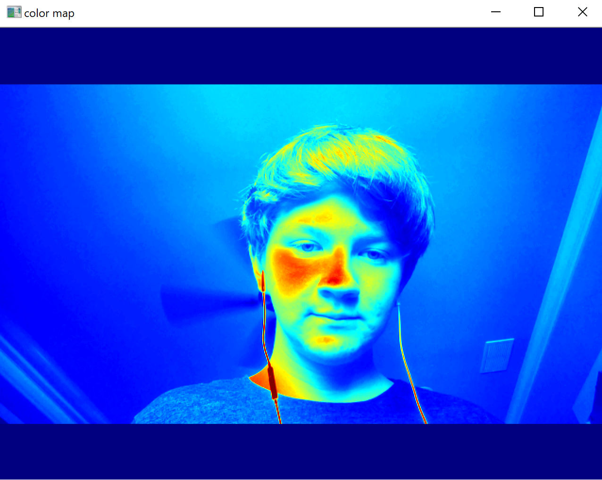
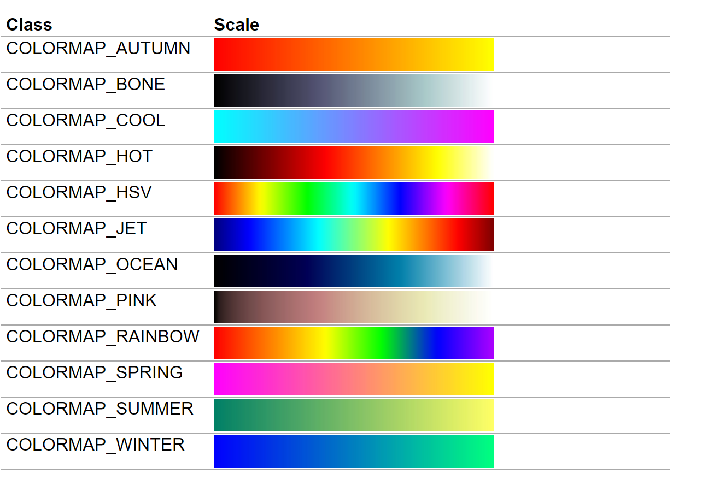
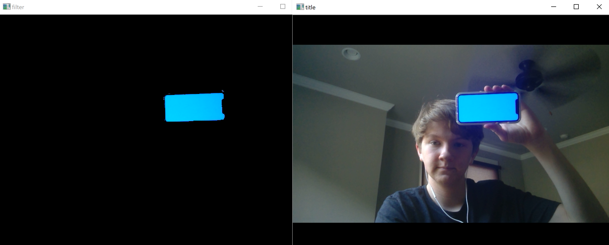
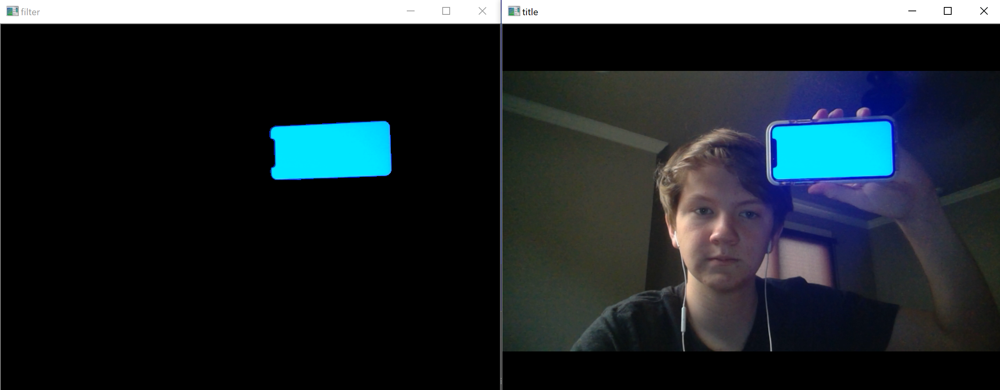
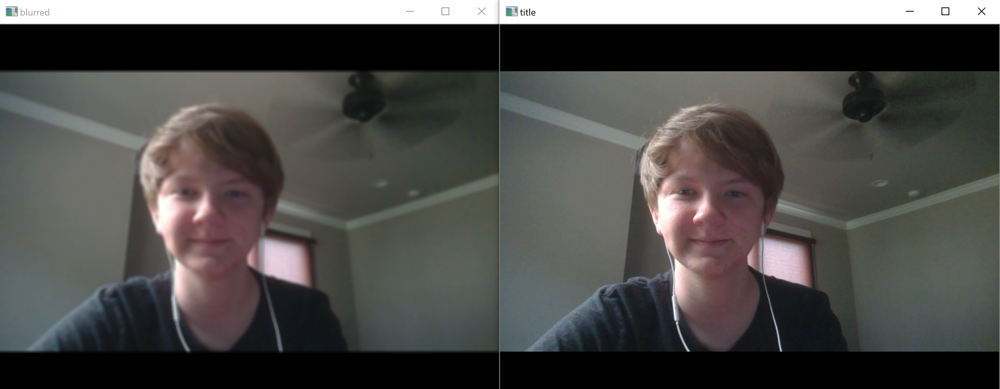
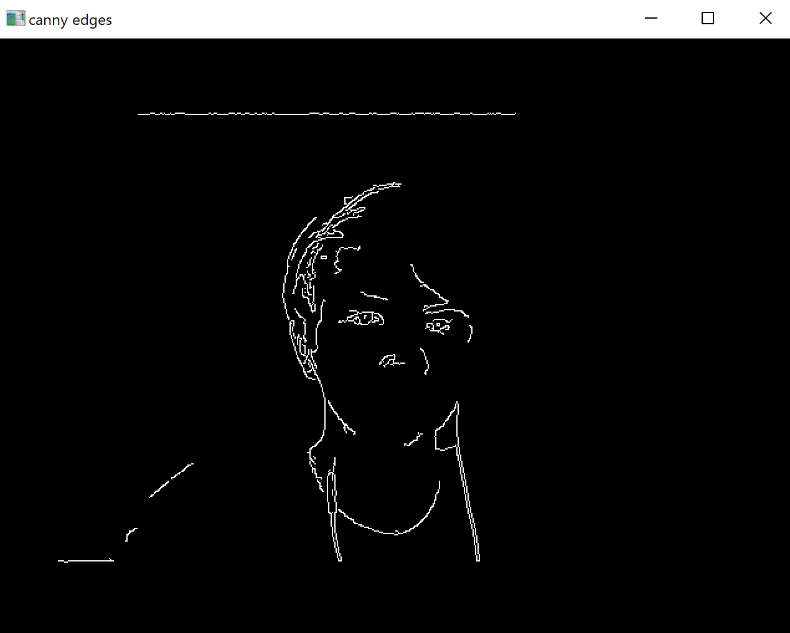

OpenCV is a widely used image processing library for python, javascript, and c++. It's applications range from filters to facial recognition software, and is one of the coolest python modules you can learn. In this tutorial, we'll be focusing on some basic features of python's OpenCV module.

## Installing OpenCV
To install OpenCV, open your terminal and type `pip install opencv-python`. Wait for it to finish installing. This can take a few minutes.

## Using OpenCV
To use OpenCV in python, we need to import it. Create a file called main.py. You can import OpenCV with the following code:

```
import cv2
```

For our tests, we're going to be using the webcam on our computer. To get an image from the webcam, you need to specify the camera. To do this you use the `cv2.VideoCapture(0)` function, which returns the camera. The 0 in there means the 0th camera, which is usually the front-facing webcam. If you have additional cameras attached to your computer, you can change it to a 1, 2, 3, etc. to use a different camera. You'll want to assign a variable to the camera. Typically, this variable is named cap: `cap = cv2.VideoCapture(0)`.

To actually get an image from this capture, you say `_, img = cap.read()`. This will read an image from the camera, and store it in the img variable. The _ variable will contain return information for debugging, such as whether or not the camera was working.

Finally, to show the image, we use the `cv2.imshow("title", img)` function. It creates a window with the specified title, and displays the given image. It will close the window immediately if not followed up with `cv2.waitKey(0)`, which stops code from execution until a key is pressed or the specified time in milliseconds is over. If the time is set to 0, it waits until a key is pressed to allow code to execute again.

Putting all of this together, we have:

```
import cv2

cap = cv2.VideoCapture(0)

_, img = cap.read()

cv2.imshow("title", img)

cv2.waitKey(0)
```

If you run the file in the terminal now with `python main.py`, you should see an image from your camera.



## Video with OpenCV

Video in OpenCV can be accomplished with a simple loop. We just restructure the code above so that it will take a picture, show it, and wait in a loop. We also want to change the time for waiting, so we don't have to press a key every frame:

```
import cv2

cap = cv2.VideoCapture(0)

while True:
    _, img = cap.read()

    cv2.imshow("title", img)

    cv2.waitKey(5)

```

Now if you run this code, it should show a video directly from your webcam. To close it, you'll have to ctrl+c in your terminal.

## Color Maps
One of OpenCV's many features includes color maps. A color map remaps each pixel to another color programmatically. To use one, you can use the `cv2.applyColorMap(img, map)` function. It takes the source image and map as arguments, and returns the re-mapped image. There are a lot of pre-made colormaps that you can use as part of the cv2 module. An example is `cv2.COLORMAP_JET`. It makes images look like heat maps. Example code for main.py is below:

```
import cv2

cap = cv2.VideoCapture(0)

while True:
    _, img = cap.read()

    cv2.imshow("title", img)

    colorMap = cv2.applyColorMap(img, cv2.COLORMAP_JET)

    cv2.imshow("color map", colorMap)

    cv2.waitKey(5)
```

If you run it now, you should get something close to this:



Here's the list of available colormaps as shown at the docs.opencv.org:



## Color Filtering

Color filtering is also pretty important. In OpenCV, there are a couple of challenges to getting it working. Normal pixels in a raster image are stored as BGR (blue, green, and red) in OpenCV, with the amount of blue, green, and red in each pixel. This makes filtering for a range of similar colors difficult. To account for this, we convert the image to HSV (hue, saturation, value). Hue is on a color wheel, so you can specify a range of 'degrees' on the wheel to get a range of similar colors. The only thing that's strange about OpenCV's implementation of this is that its color wheel goes 0-180 degrees, with 0 and 180 being red. To convert BGR to HSV, we use the function `cv2.cvtColor(img, cv2.COLOR_BGR2HSV)` to convert an image to hsv. This function returns the converted image. Then, to do the actual color filtering, we can create a mask with the `cv2.inRange(img, lower, upper)` function. It takes the source image and two tuples as arguments, for a lower and upper range of color channels. HSV images contain three channels, one for hue, saturation, and value respectively. The inRange function returns a mask, which is like a normal image, but instead of being in RGB or HSV, it only has one channel for black or white. Each pixel will be white for true or black for false. Finally, we can re-apply the mask to the original image to get the result we want with `cv2.bitwise_and(img, img, mask=mask)`. The bitwise and function itself isn't necessary for this, but the part of it that applies the mask is helpful. Here's some sample code of these ideas:

```
import cv2

cap = cv2.VideoCapture(0)

while True:
    _, img = cap.read()

    cv2.imshow("title", img)

    colorMap = cv2.applyColorMap(img, cv2.COLORMAP_JET)

    cv2.imshow("color map", colorMap)


    hsv = cv2.cvtColor(img, cv2.COLOR_BGR2HSV)

    mask = cv2.inRange(hsv, (90, 120, 120), (110, 255, 255))

    colorFilter = cv2.bitwise_and(img, img, mask=mask)

    cv2.imshow("filter", colorFilter)

    cv2.waitKey(5)
```

(note: The ranges used for the inRange function filter for blue-ish colors with the 90-110 hue range, and bright-ish colors with the 120-255 saturation and value range. This way, I was able to filter for the blue image I had on my phone.)

The result looked like this for me:



Feel free to change the values in the inRange function to see how they affect your images!

## Blur

Blurring is useful for noise reduction, so that other techniques for image processing will work better. You can see this with the extra blue pixels in the color filtering picture. If we redo the color filtering with a blur, we get the following result, with no pixels outside of the phone:



This just averages a rectangle of pixels around each and sets the center pixel to be equal to this average. This way the transitions in color will be smoother and more blurred. OpenCV's implementation of this is the `cv2.blur(img, rectangle)` function. The rectangle is a tuple of size two that represents the size of the rectangle around each pixel. Adding this blur to the main.py code: 

```
import cv2

cap = cv2.VideoCapture(0)

while True:
    _, img = cap.read()

    cv2.imshow("title", img)

    colorMap = cv2.applyColorMap(img, cv2.COLORMAP_JET)

    cv2.imshow("color map", colorMap)


    hsv = cv2.cvtColor(img, cv2.COLOR_BGR2HSV)

    mask = cv2.inRange(hsv, (90, 120, 120), (110, 255, 255))

    colorFilter = cv2.bitwise_and(img, img, mask=mask)

    cv2.imshow("filter", colorFilter)


    blur = cv2.blur(img, (5, 5))

    cv2.imshow("blurred", blur)


    cv2.waitKey(5)
```

It should look somehting like this:


## Canny Edge Detection

Canny edge detection can be useful for object recognition. It's a way to (sort of) find the edges in an image. It's best when combined with other techniques like color filtering, but is still cool when done by itself. It's also made very simple with openCV: `cv2.Canny(img, lower, upper)`. All pixels are given a 'likelyhood' of being an edge based on the contrast of the pixels around it. If a pixel has a highly 'likelyhood' than the upper parameter, it's guaranteed to be an edge. If the 'likelyhood' is lower than the lower parameter, it's guaranteed to not be an edge. If it's in between, it will be counted as an edge if it's part of an edge that contains pixels above the upper parameter. Here's some test code showing canny edges:

```
import cv2

cap = cv2.VideoCapture(0)

while True:
    _, img = cap.read()

    cv2.imshow("title", img)

    colorMap = cv2.applyColorMap(img, cv2.COLORMAP_JET)

    cv2.imshow("color map", colorMap)


    hsv = cv2.cvtColor(img, cv2.COLOR_BGR2HSV)

    mask = cv2.inRange(cv2.blur(hsv, (5, 5)), (90, 120, 120), (110, 255, 255))

    colorFilter = cv2.bitwise_and(img, img, mask=mask)

    cv2.imshow("filter", colorFilter)


    blur = cv2.blur(img, (5, 5))

    cv2.imshow("blurred", blur)


    canny = cv2.Canny(img, 50, 100)

    cv2.imshow("canny edges", canny)

    cv2.waitKey(5)
```

Here's what your image should look like: 



## Conclusion

After learning the basics of OpenCV, you now have more tools available for learning image processing! Try playing around with the values in your main.py file and seeing what happens. Also try combining different functions and filters to see what happens.