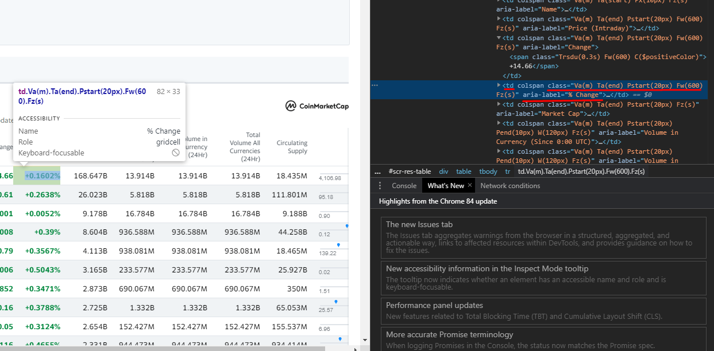

## What are you trying to accomplish?

The first thing you need to know is what you are trying to scrape from a webpage.\
Is it the url, the content, a specific element on the page...?

The answer to that question will allow you to get started.

Let's take Yahoo Finance for example.


I want to the percent change in value from Yahoo Finances Cryptocurrency page
(<https://finance.yahoo.com/cryptocurrencies>).

To allow my scraper to easily find this data, I'm going to find the element in the HTML that this part of data corresponds to.



That gave me some good information. It may look a little crazy, but I know the data I'm looking for is going to be in a &lttd&gt element.\
I also know the data is going to have the class "Va(m)" among others, and the aria-label "% Change".

Okay! We're probably good to get started!

## Creating the file

For this tutorial, we're going to use Selenium.\
Selenium is a package that acts as a headless web browser.\
It allows you to act as a browser, even when you aren't one without much hassle during setup.
Other methods could be faster, but we aren't making thousands of requests per second.

Selenium is going to require a web driver. 

Previously, I would have suggested PhantomJS, however the project seems to have been abandoned :(

Instead, we're going to use a headless version of Chrome. We want to enable headless mode because otherwise the browser would popup every time we wanted to make a request and that would get annoying.

> Chromium WebDriver: <https://sites.google.com/a/chromium.org/chromedriver/downloads>

I would create a folder that will hold both your python file and your webdriver.
Speaking of that python file, create a new python file named scraper.py.

In your command prompt, or Git Bash (as we at Code Decatur prefer), type 'pip install selenium'

```
pip install selenium
```

Once you're in your file, import the driver and we can start rolling!

```
from selenium import webdriver

path_to_driver = 'chromedriver'
driver = webdriver.Chrome(executable_path=path_to_driver)
driver.get('https://finance.yahoo.com/cryptocurrencies')
```

This would be a good setup if we wanted to open a chrome window, but again, we want a headless version of chrome. So lets fix that.

```
from selenium import webdriver
from selenium.webdriver.chrome.options import Options

options = Options()
options.headless = True
path_to_driver = 'chromedriver'
driver = webdriver.Chrome(executable_path=path_to_driver, options=options)
driver.get('https://finance.yahoo.com/cryptocurrencies')

print(driver.page_source)
driver.quit()
```

We can see here by adding the headless property using selenium's Options object, we don't have to open a physical browser to make a request like we're a browser.

If we tried to make this request with something like Python's requests module, it would return little to no information because some sites (Like Yahoo) require you to be an actual browser to give you data.

## Finding what we want

So we know we want a &lttd&gt tag with the aria-label "% Change".
Okay.
How would we tell Selenium to look for that?

Well, Selenium offers a plethora of ways to go about this.
We're going to use find element and XPath, because we have an odd property (aria-label)

XPath is a part of Selenium called XML Path. It is a syntax method for finding elements.
It's a little more complicated if you look into it, but generally, you only have to understand a few things.

<deckgo-highlight-code language="python">
<code slot="code">
xpath = "//tagname\[@attribute='value']"
#// is the current node we search from
#tagname is the html tagname
#@attribute is the attribute, in our case, aria-label
#value is the value of the attribute
</code>
</deckgo-highlight-code>

```
from selenium import webdriver
from selenium.webdriver.chrome.options import Options

options = Options()
options.headless = True
path_to_driver = 'chromedriver'
driver = webdriver.Chrome(executable_path=path_to_driver, options=options)
driver.get('https://finance.yahoo.com/cryptocurrencies')
xpath = "//td[@aria-label='% Change']"
td = driver.find_element_by_xpath(xpath)
print(td)
driver.quit()
```

We can see that if we run this code, we get an element back with the type WebElement.
However, we can see that this is only one element, but we can see theres an entire column of % change values.

```
driver.find_elements_by_xpath(xpath)
```

Now we get a bunch of elements back. Great!
But we want the text in that element. How do we do that? 
Simple. With td.text.

```
from selenium import webdriver
from selenium.webdriver.chrome.options import Options

options = Options()
options.headless = True
path_to_driver = 'chromedriver'
driver = webdriver.Chrome(executable_path=path_to_driver, options=options)
driver.get('https://finance.yahoo.com/cryptocurrencies')
xpath = "//td[@aria-label='% Change']"
td = driver.find_elements_by_xpath(xpath)
for i in td:
    print(i.text)
driver.quit()
```

Yes! We got all of the data! Now we can use this data in any project we want!

There's a lot of functionality you can get out of Selenium. Feel free to experiment.

> Check out the docs: <https://selenium-python.readthedocs.io/>